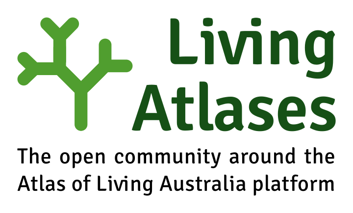

## Living Atlases Artwork repository

### Logo

We tried to reference with this logo to both [ALA](https://www.ala.org.au/ala-logo-and-identity/) and [GBIF identities](https://www.gbif.org/logos).

We use this open font:

https://fonts.google.com/specimen/Signika?preview.text=Living%20Atlases&preview.text_type=custom

#### Icon transparent

#### Icon in white circle (WIP)

#### Favicon

